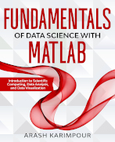

.. YA LATIF

Fundamentals of Data Science with MATLAB
========================================

Fundamentals of Data Science with MATLAB: Introduction to Scientific Computing, Data Analysis, and Data Visualization

Order at Amazon: https://www.amazon.com/dp/1735241016

In this book, readers learn about:

* Programming with the MATLAB language
* Data science, analysis, and visualization with the MATLAB language
* MATLAB arrays• MATLAB statistical functions
* MATLAB tables• Time-series in MATLAB
* Data visualization with MATLAB
* Interpolation, curve fitting, root finding, and numerical integration
* Signal processing and digital filtering
* Reading and writing data files

Contents
--------

Chapter 1 Set Up MATLAB	1
    | 1.1 Introduction to MATLAB Language	2
    | 1.2 Install MATLAB	2
    | 1.3 MATLAB Desktop	3
    | 1.4 MATLAB Toolboxes and Packages	3
    | 1.5 Run MATLAB Script	4

Chapter 2 Introduction to MATLAB Programming	7
    | 2.1 MATLAB Syntax Style	8
    | 2.2 MATLAB Built-in Functions, Add-on Toolboxes, and Third-Party Packages	10
    | 2.3 Mathematical Operators	11
    | 2.4 Comparison Operators	13
    | 2.5 Logical Operators	14
    | 2.6 Integer and Floating Point	15
    | 2.7 Complex Numbers	16
    | 2.8 Strings	18
    | 2.9 Vector Creation	27
    | 2.10 The if Statement	29
    | 2.11 The for Statement	35
    | 2.12 The while Statement	39
    | 2.13 Define a Function	41
    | 2.14 The varargin	48
    | 2.15 Define Anonymous Function	50
    | 2.16 Name-Value Pair Arguments	52
    | 2.17 Tilde ( ~ )	52
    | 2.18 Working with File and Directory	53

Chapter 3 Introduction to MATLAB Array	55
    | 3.1 MATLAB Arrays	56
    | 3.2 Vector, Matrix, and Array	57
    | 3.3 Vector	58
    | 3.4 Matrix	59
    | 3.5 Multi-Dimensional Array	61
    | 3.6 Array Data Type	61
    | 3.7 Array Dimension	63
    | 3.8 Array Indexing	65
    | 3.9 Array Slicing	67
    | 3.10 Indexing by Index Array	72
    | 3.11 Logical Indexing	74
    | 3.12 Change Element Contents in Array	77
    | 3.13 Cell Array	78
    | 3.14 Structure Array	80

Chapter 4 Working with MATLAB Array	85
    | 4.1 Copy Array	86
    | 4.2 Append, Insert, and Delete Array Elements	86
    | 4.3 Obtain Array Shape and Size	89
    | 4.4 Reshape Array	94
    | 4.5 Flip Array	96
    | 4.6 Concatenate Arrays	98
    | 4.7 Array Initialization	102
    | 4.8 Element-Wise Operation and Comparison	105
    | 4.9 Find Indexes	106
    | 4.10 NaN and Inf	109
    | 4.11 Generate Sequence of Numbers	110

Chapter 5 Basic Statistics	115
    | 5.1 Array Dimension	116
    | 5.2 Statistical Functions	116
    | 5.3 Sum and Mean of Array	117
    | 5.4 Minimum and Maximum of Array	119
    | 5.5 Sort Array	122
    | 5.6 Random Number	124
    | 5.7 Generate Reproducible Random Number	127
    | 5.8 Histogram and Probability Density Function of Dataset	128

Chapter 6 Introduction to MATLAB Table	133
    | 6.1 Table	134
    | 6.2 Create Table	134
    | 6.3 Table Properties and Functions	137
    | 6.4 Table Indexing and Slicing	139
    | 6.5 Change Item Contents in Tables	143

Chapter 7 Working with Table	147
    | 7.1 Functions and Properties	148
    | 7.2 Append, Insert, and Delete Single Row or Single Column	148
    | 7.3 Append, Insert, and Delete Multiple Rows or Multiple Columns	153
    | 7.4 Concatenate Tables	157
    | 7.5 Merge and Join Tables	161
    | 7.6 Rearrange Columns	167
    | 7.7 Arithmetic and Element-Wise Operation	169
    | 7.8 Apply Function	170
    | 7.9 Group Data	172
    | 7.10 Clean and Fill Missing Data	181
    | 7.11 Rolling Window	186

Chapter 8 Date, Time, and Time-Series	193
    | 8.1 Date and Time in MATLAB	194
    | 8.2 Generate Time-Series with MATLAB	199
    | 8.3 Generate Time-Table	201
    | 8.4 Time-Table Indexing and Slicing	206
    | 8.5 Shift Data in Time-Table	210
    | 8.6 Clean and Fill Missing Data in Time-Table	212
    | 8.7 Resampling Time-Table	216

Chapter 9 Introduction to Data Visualization with MATLAB	225
    | 9.1 MATLAB Plots	226
    | 9.2 Line Plot	227
    | 9.3 Set Color	231
    | 9.4 Set Line Style and Line Width	234
    | 9.5 Add Marker	236
    | 9.6 Add Labels	239
    | 9.7 Set Axis Limits and Ticks	240
    | 9.8 Add Grid Lines	243
    | 9.9 Add Text and Annotation	244
    | 9.10 Add Mathematical Text	247
    | 9.11 Plot Multiple Lines and Add Legend	250
    | 9.12 Create Multiple Figures	254
    | 9.13 The get and set Functions	255
    | 9.14 Remove White Space around Axes	261
    | 9.15 Explore Plot Interactively	262

Chapter 10 Advanced Data Visualization with MATLAB	263
    | 10.1 Colormaps	264
    | 10.2 Extract Colors from Colormap	266
    | 10.3 Create Colormap	267
    | 10.4 Scatter Plot	268
    | 10.5 Contour and Image Plot	272
    | 10.6 Bar Plot	275
    | 10.7 Histogram Plot	276
    | 10.8 Axes	279
    | 10.9 Create Subplots	282
    | 10.10 Create Unequal Subplots	286
    | 10.11 Procedural and Object-Oriented Plotting	289
    | 10.12 Time-Series Plot	292
    | 10.13 The 3-Dimensional Plot	295
    | 10.14 Map Plot	297

Chapter 11 Interpolation, Curve Fitting, Root Finding, and Numerical Integration with MATLAB	305
    | 11.1 Generate 1-Dimensional Grid Coordinates	306
    | 11.2 Generate 2-Dimensional Grid Coordinates	307
    | 11.3 The 1-Dimensional Interpolation	309
    | 11.4 The 2-Dimensional Interpolation	311
    | 11.5 Curve Fitting	316
    | 11.6 Curve Fitting by Optimization	319
    | 11.7 Root Finding	321
    | 11.8 Solve System of Linear Equations	324
    | 11.9 Numerical Integration	325

Chapter 12 Introduction to Signal Processing	327
    | 12.1 Wave Function	328
    | 12.2 Sampling Frequency	329
    | 12.3 Control Data Quality	332
    | 12.4 Detrend Data	335
    | 12.5 Time and Frequency Domains	337
    | 12.6 Fourier Analysis	339
    | 12.7 Fast Fourier Transform	340
    | 12.8 Frequency Ordering of Fast Fourier Transform	341
    | 12.9 Double-Sided FFT and Single-Sided FFT	344
    | 12.10 Wave Amplitudes from FFT	347
    | 12.11 Estimate Power Spectral Density from FFT	350
    | 12.12 Estimate Power Spectral Density from Periodogram and Welch Method	354

Chapter 13 Basics of Window Function and Digital Filter	359
    | 13.1 Convolution	360
    | 13.2 Window Function	360
    | 13.3 Digital Filter	364
    | 13.4 Digital Filter Band-Forms	367
    | 13.5 Basic Low-Pass FIR Filter	368
    | 13.6 Basic High-Pass, Band-Pass and Band-Stop FIR Filters	372
    | 13.7 Design Basic FIR Filters with MATLAB	374
    | 13.8 Smooth Data by Moving Average	377
    | 13.9 Smooth Data by Savitzky-Golay Filter	382
    | 13.10 Smooth Data by Butterworth Filter	384
    | 13.11 Filter Out Frequency Range from Data	386

Chapter 14 Read and Write Data Files	393
    | 14.1 Read Text and ASCII Files with fopen	394
    | 14.2 Read CSV Files	397
    | 14.3 Read Text, ASCII, and CSV Files as Array	398
    | 14.4 Read Text, ASCII, and CSV Files as Table	399
    | 14.5 Save and Load Data Files	400

References	403

Index	405

License
-------

CC BY-NC-SA 4.0 License

Fundamentals of Data Science with MATLAB: Introduction to Scientific Computing, Data Analysis, and Data Visualization

Copyright (c) 2022 Arash Karimpour

All rights reserved

Fundamentals of Data Science with MATLAB: Introduction to Scientific Computing, Data Analysis, and Data Visualization
© 2020 by Arash Karimpour is licensed under CC BY-NC-SA 4.0 (https://creativecommons.org/licenses/by-nc-sa/4.0/)
